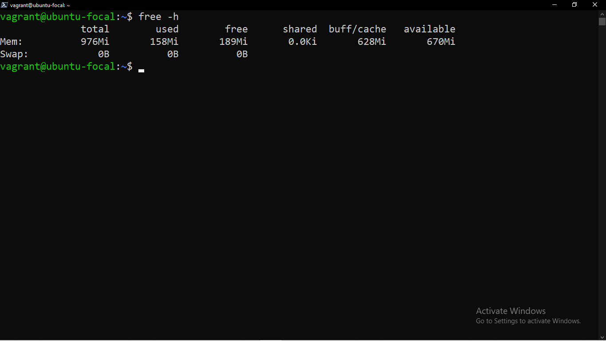
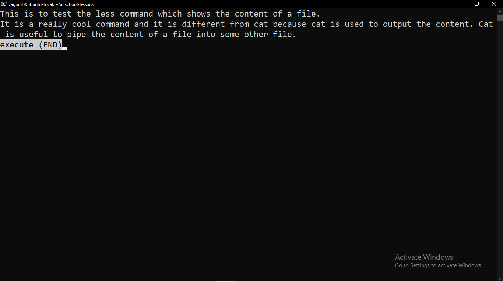
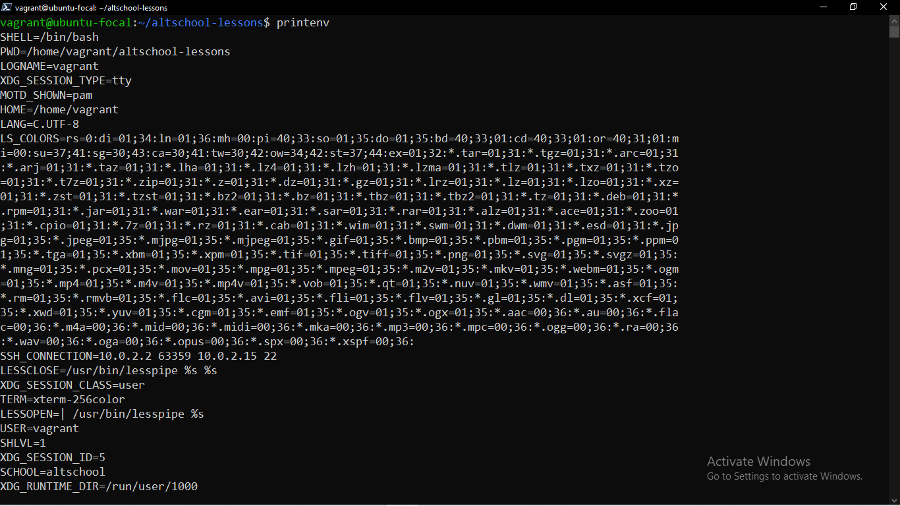
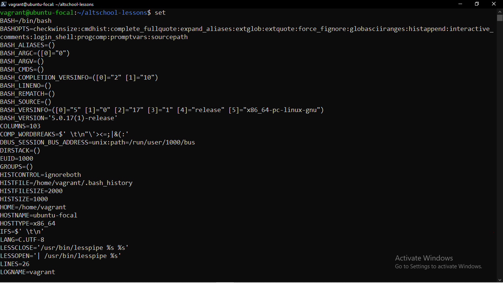
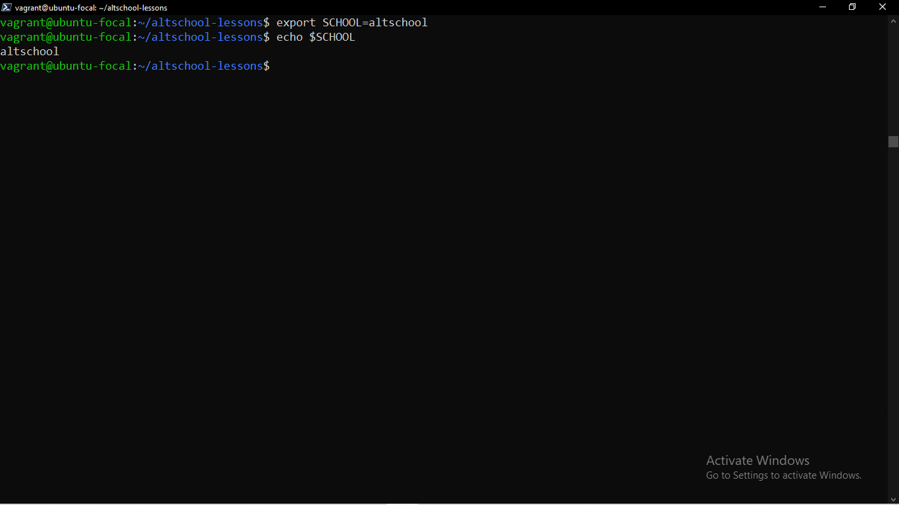
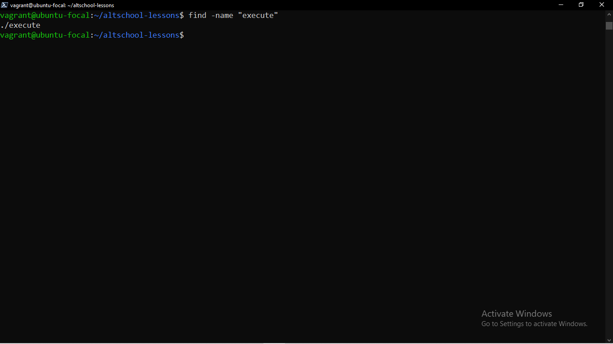
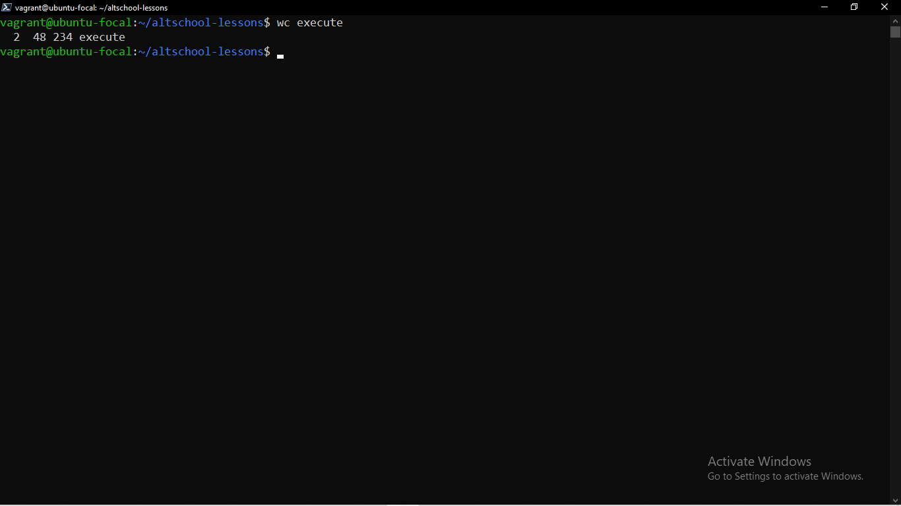
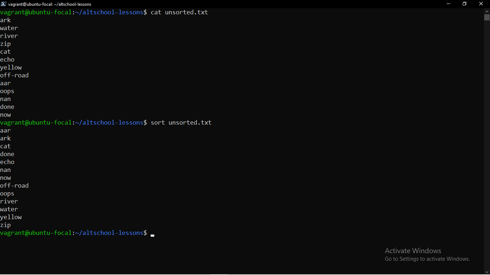

# Linux Commands And Uses

- free :- This is used to display the free and used memory 
options are : h (for human readable), m (for MB), g (for GB) 
eg free -h should output 

- chmod :- This is a command used too change the assess mode of a file. 
Syntax is :- chmod <\reference><\operator><\mode> file.  
The reference means the user groups to give the permission; we have three groups which are owner(u), group(g) and others(o).  
The operator specifies how to adjust the modes/permission. There are three also: to add(+), to remove(-), exact(=). 
The modes indicate the permissions to be added or removed. We have three which are: read(r), write(w), execute a file or search a dir(x).  
eg to give owner the permission to run a file as an executable use chmod u+x filename. 

- less :- To shows the content of a file. 
Syntax is :- less <\filename>  
eg less execute  

- printenv :- to print out global environment variables 
eg printenv 

- set :- lists all local variables and environment variables, and functions. 
eg set 

- export :- This is used to create a local variable. note to create a global variable, do not use export, just the variable name and value is fine.  
syntax is export variable_name=variable_value 
eg export SCHOOL=altschool 

- find : This is used to search the file directory for a file. 
syntax :- In its simplest form -- find -name <\filename/matches> 
eg find -name "execute" 

- wc :- stands for word count. It is mainly used for counting purpose. It displays no of lines, words and characters in that order 
syntax :- wc [option] [file]  
eg '''wc execute''' 

- sort :- this sorts the content of a file in ASCII order. The result can be piped into another file.  
syntax :- sort [filename] 
eg sort unsorted.txt 
